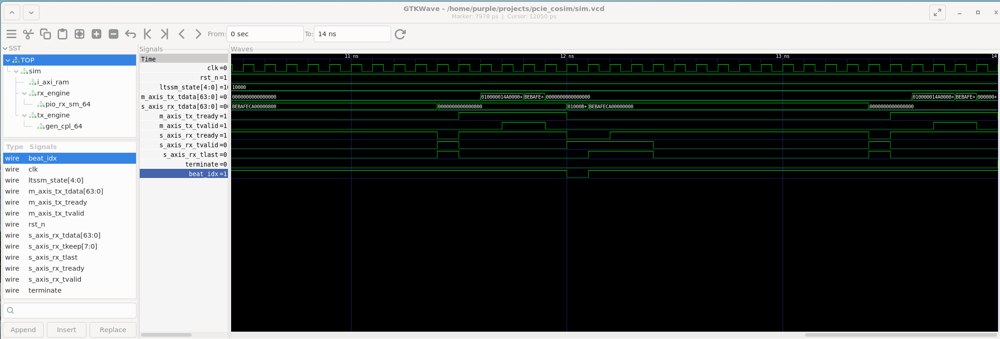
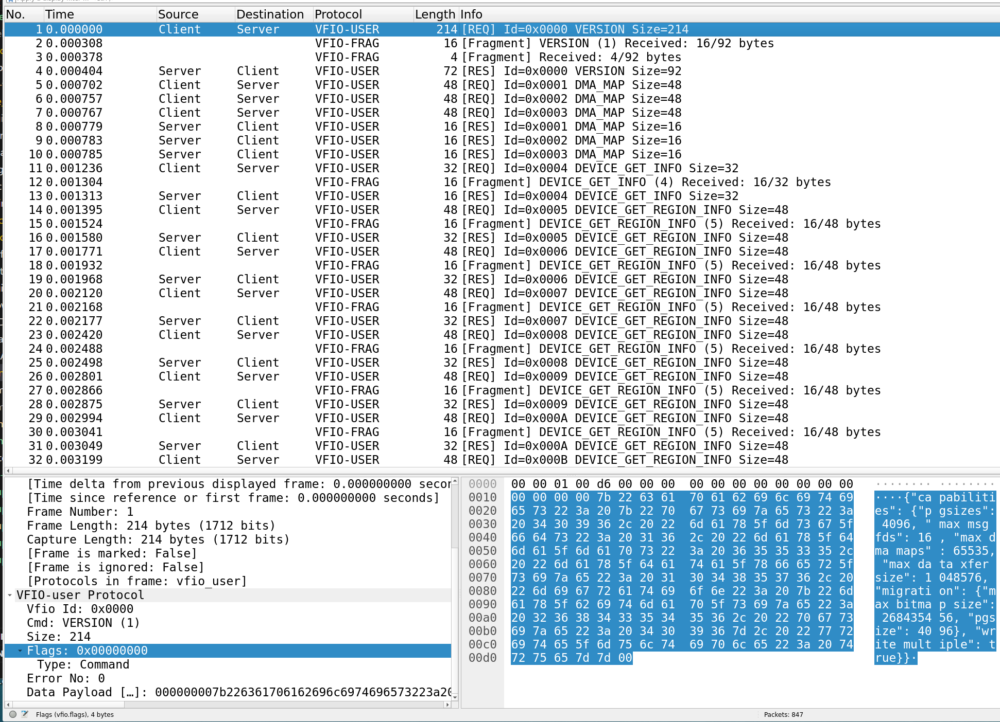
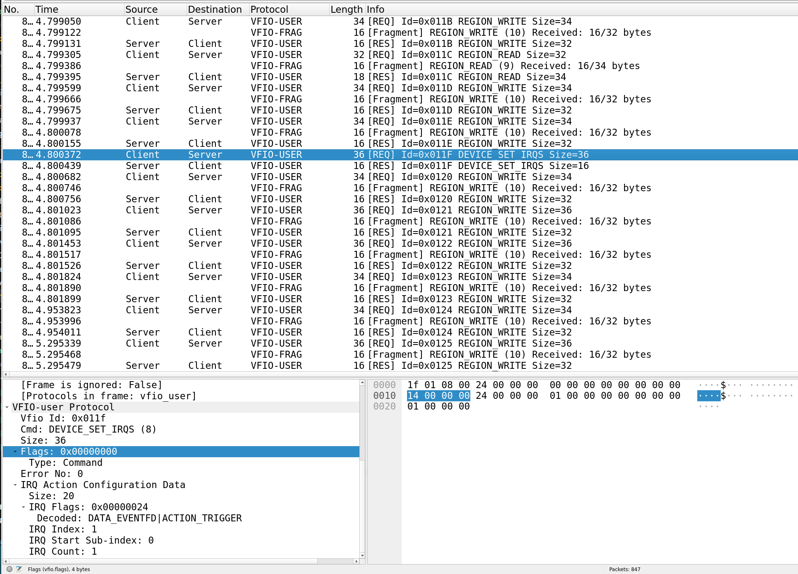
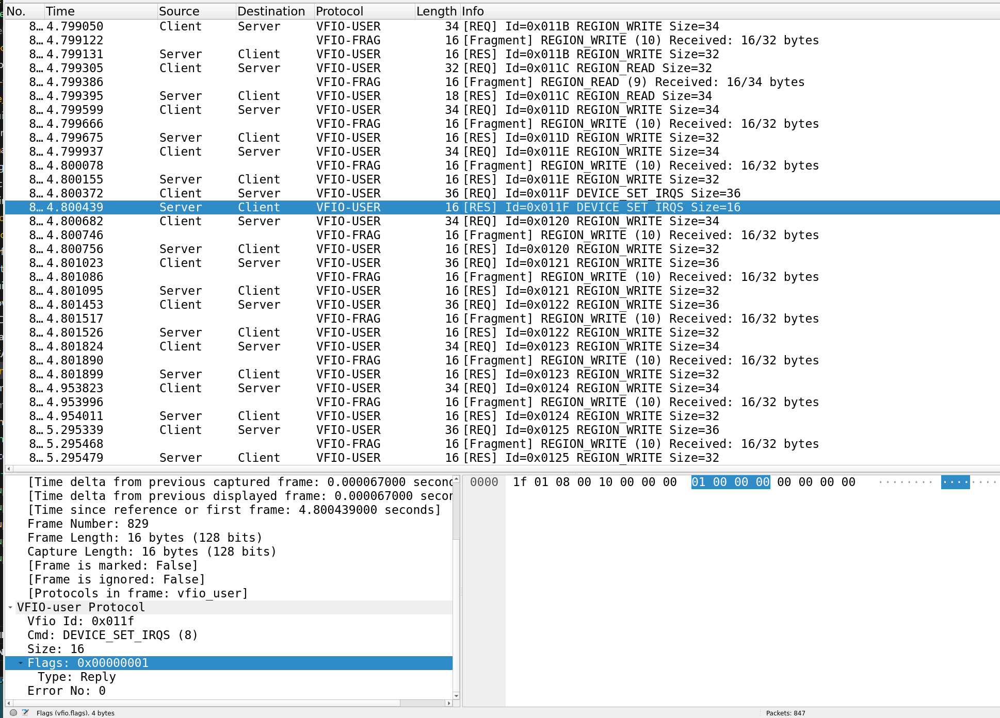

# PCIe Cosim

PCIe co-simulation framework using Verilator and QEMU vfio-user-pci with openPCIE and AXI RAM endpoint RTL blocks.

## Project Structure

- **`common/`**: Core infrastructure logic and logging primitives.
    - `include/`: Shared header templates for logging, packet protocols, and IPC socket channels.
    - `src/`: The socket channel definitions and system infra layers.
- **`src/bridge/`**: The host environment bridge mapping the `vfio-user` protocol layer onto the simulation.
- **`src/hdl/`**: Core synthesizable components (`axi_ram.v`) and top-level structural wrapper (`sim_top.sv`).
- **`src/sim/`**: Verilator hardware simulation wrapper orchestration logic and memory transaction drivers.
- **`logs/`**: Dynamic execution logs captured during live validation simulation sweeps.
- **`third_party/`**: External library frameworks and environment dependencies.
    - `hw/`: Workspace directory context targeting local `openPCIE` repository tracking node.
    - `lib/`: Workspace directory context targeting local `libvfio-user` repository compilation tree.
    - `os/images/linux/`: Local loop assets, file system initialization targets, and platform kernels.
- **`tool/net/`**: The 'sockdump.py' packet sniffer tool and wireshark vfio-user protocol dissector
- `build_vmlinuz.v6.8_pcie_cosim.sh`: Utility script adapting kernel compilation arrays with target co-simulation parameters.
- `download_os_images.py`: Automation script parsing cloud distribution layers down to the execution image tree.
- `run_pcie_agent.py`: System automation script wrapping QEMU guests alongside the target RTL Verilated simulation.
- `sim_waveform.gtkw`: GTKWave waveform trace file to load a generated `sim.vcd`.

## High Level Architecture Diagram

The PCIe Cosim Bridge acts as a vfio-user server, facilitating communication between the QEMU and the PCIe Endpoint Simulation. When the PCIe Bridge receives a vfio-user message from QEMU it forwards the PCIe packets to the PCIe Simulation, which completes the PCIe transaction. For no-posted operations like MRd, the PCIe Simulation sends an ACK along with the requested data back to the PCIe Bridge, which then forwards the data to QEMU.

```text
    +---------------------------------+
    |                                 |
    | (QEMU vfio-user-pci) + Linux OS |
    |                                 |
    +---------------------------------+
                    ^
                    |
            vfio-user proto (UDS) 
                    |
                    v
    +---------------------------------+
    |         libvfio-user            |
    |       (vfio-user Server)        |
    |                                 |
    |       PCIe Cosim Bridge         |
    |                                 |
    |       (UDS/TCP Client)          |
    +---------------------------------+
                    ^^
                    ||
            soft-TLP proto (UDS/TCP) 
                    ||
                    vV
    +---------------------------------+
    |       (UDS/TCP Server)          |
    |                                 |
    |   Verilated PCIe Sim Endpoint   |
    +---------------------------------+
```

## Quick Start

### 1. Prerequisites

 - **Build Tools**: `gcc`, `ninja`, `make`
 - **Python**: `python3`
```text
    sudo apt install python3-pexpect
```
 - **Verilator**:
```text
    git clone https://github.com/verilator/verilator.git
    For install from git refer to Verilator User Guide at https://verilator.org/guide/latest/install.html
```
 - **QEMU**:
```text
    sudo apt install -y libjson-c-dev libpixman-1-dev libglib2.0-dev libslirp-dev
    sudo apt purge qemu-system-x86
    git clone https://github.com/qemu/qemu.git
    cd qemu/
    ./configure --target-list=x86_64-softmmu --enable-kvm --enable-debug --enable-slirp
    make -j$(nproc)
    cd build/
    sudo ninja install
```
 - **openPCIE**:
```text
    git clone https://github.com/chili-chips-ba/openPCIE.git
    cd /path/to/your/local/PcieCosim/third_party/hw
    ln -s /path/to/your/local/openPCIE openPCIE
    Example:
        ln -s /home/purple/soc/openPCIE openPCIE
```
 - **libvfio-user**:
```text
    git clone https://github.com/nutanix/libvfio-user.git
    cd /path/to/your/local/PcieCosim/third_party/lib
    ln -s /path/to/your/local/libvfio-userlibv fio-user
    Example:
        ln -s /home/purple/tools/libvfio-user libvfio-user
```
 - **linux kernel**:
```text
    git clone https://github.com/torvalds/linux.git
    cd linux
    git checkout v6.8
```
### 2. Get Linux Distribution

To download Linux Distribution images do
```text
    chmod +x /path/to/your/local/PcieCosim/download_os_images.py
    /path/to/your/local/PcieCosim/download_os_images.py
```
This installs CirrOS Linux distribution.
To download Fedora or Ubuntu distribution do
```text
    /path/to/your/local/PcieCosim/download_os_images.py --distro fedora|ubuntu
```

### 3. Build

To build Linux kernel image with PCIe Co-Simulation configuration changes do
```text
    chmod +x /path/to/your/local/PcieCosim/build_vmlinuz.v6.8_pcie_cosim.sh
    /path/to/your/local/PcieCosim/build_vmlinuz.v6.8_pcie_cosim.sh
```
this generates the customized target kernel and copies the image asset into `/path/to/your/local/PcieCosim/third_party/os/images/linux`

To build PCIe co-simulation do
```text
    /path/to/your/local/PcieCosim/make
        or
    /path/to/your/local/PcieCosim/make trace - to add waveform trace
```
this outputs target executable to `/path/to/your/local/PcieCosim/build/pcie_sim`

#### 3.1 PCIe Co-simulation Build Configuration settings

The default co-simulation build options can be modified in `/path/to/your/local/PcieCosim/Makefile`:

```text
    LOG_LEVEL         = 40 (default), where SW Log Levels are: 0=NONE, 10=CRITICAL, 20=ERROR, 30=WARNING, 40=INFO, 50=DEBUG
    ENABLE_SW_LOGS    = 1  (default), where 0 disables SW logging
    ENABLE_HW_LOGS    = 1  (default), where 0 disables HW logging in RTL PCIe Endpoint blocks
    ENABLE_PKT_LOGS   = 0  (default), where 1 enables internal Soft-TLP packet logging  
    ENABLE_WAIT_LIMIT = 1  (default), where 1 enables a timeout limit for PCIe Sim communication channel establishment
```

### 4. Run

Execute the automation wrapper to start PCIe co-simulation with QEMU, bridge daemon, and RTL PCIe AXI RAM endpoint simulation:
```text
    chmod +x /path/to/your/local/PcieCosim/run_pcie_agent.py
    /path/to/your/local/PcieCosim/run_pcie_agent.py
```
This runs co-simulation with CirrOS Linux distribution.
To run co-simulation with Fedora or Ubuntu distribution do
```text
    /path/to/your/local/PcieCosim/run_pcie_agent.py --distro fedora|ubuntu
```
#### 4.1 Run Agent Configuration settings

You can configure the following variables in `run_pcie_agent.py`:

- `enableAutomatedTest`: Enables or disables the automated verification test suite (True/False).
- `testMatrix`: Selects the specific test cases to execute (default: `[1, 2, 3, 4]`).
- `enableVerbose`: Enables or disables verbose formatting for internal `libvfio-user` logs (True/False).
- `enableSniffer`: Enables or disables the eBPF-based VFIO-User packet sniffer (True/False).

### 5. Other

### 5.1 Optional

#### 5.1.1 GTKWave

To visualize PCIe Simulation RTL signalling install GTKWave:
```text
    sudo apt install gtkwave -y
```
You can see the simulation traces by running `make wave` or `gtkwave sim_waveform.gtkw`.



#### 5.1.2 Wireshark Packet Sniffer

To visualize vfio-user message exchange install Wireshark and configure a packet sniffer to capture VFIO-User traffic over the UNIX Domain Socket (UDS) channel between QEMU and the PCIe Co-simulation Bridge:
```text
    sudo apt install -y wireshark
    sudo setcap 'CAP_NET_RAW+eip CAP_NET_ADMIN+eip' /usr/bin/dumpcap
    sudo chmod +x /usr/bin/dumpcap
    newgrp wireshark
```
The `run_pcie_agent.py` automation script uses the `sockdump.py` to capture VFIO-User traffic. The `sockdump.py` script depends on the Extended Berkeley Packet Filter (eBPF) packages installed:
```text
    sudo apt install python3-bpfcc bpfcc-tools
```
The Wireshark dissector for the VFIO-User protocol is named `vfio_user.lua`. To install it, copy the dissector file to your local Wireshark plugins directory:
```text
    mkdir -p ~/.config/wireshark/plugins
    cp /path/to/your/local/PcieCosim/tools/net/vfio_user.lua ~/.config/wireshark/plugins/vfio_user.lua
```
Next, configure the sudoers file to grant the necessary permissions for executing the packet capture tool without password prompts:
```text
    Example configuration via '$ sudo visudo':

    # Allow members of group sudo to execute any command
    %sudo

    purple ALL=(ALL) NOPASSWD: /usr/bin/kill
    purple ALL=(ALL) NOPASSWD: /usr/bin/chown
    purple ALL=(ALL) NOPASSWD: /usr/bin/chmod
    purple ALL=(ALL) NOPASSWD: /usr/bin/python3 /home/purple/PcieCosim/tools/net/sockdump.py *

    # See sudoers(5) for more information on "@include" directives:
    @includedir /etc/sudoers.d
    ...
```
If you enable the packet sniffer in `run_pcie_agent.py` by setting `enableSniffer = True`, a `vfio-user.pcap` file will be generated in `/path/to/your/local/PcieCosim/logs`.





### 5.2 Fedora or Ubuntu Linux Distribution

Fedora and Ubuntu cloud images do not have a default password and lock the root account by default for security. You need to run the following scripts to set a user password for the default user name:
```text
    /path/to/your/local/PcieCosim/third_party/os/images/linux/setup_fedora_password.sh
    /path/to/your/local/PcieCosim/third_party/os/images/linux/setup_ubuntu_password.sh
```
If you download/update an indvidual Linux Distribution image you can set a symbolic link for it with the `update_links_only.py` script:
```text
    /path/to/your/local/PcieCosim/third_party/os/images/linux/update_links_only.py
```